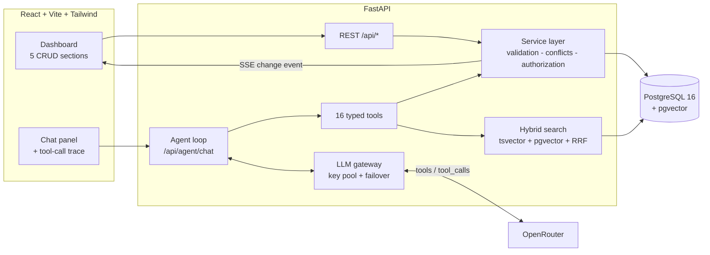

<div align="center">

# 🏫 CampusOS

**A campus platform for AUST CSE — five live systems, one dashboard, and an AI agent that actually does things.**

[](https://cse-carnival-8-aibuild-hackathon.vercel.app/)
[](https://cse-carnival-8-aibuild-hackathon.onrender.com/api/meta)

[](https://www.python.org/)
[](https://fastapi.tiangolo.com/)
[](https://react.dev/)
[](https://www.postgresql.org/)
[](https://tailwindcss.com/)

</div>

> [!NOTE]
> The hosted API runs on a free tier and sleeps when idle — **the first request can take 30–60 seconds** while it wakes up. Local setup has no such delay.

---

## 📖 Project Overview

**CampusOS** puts a student's entire campus life in one place: **class schedules**, **rooms** (with booking), **events** (with registration), **announcements**, and **assignment deadlines**. Every record lives in PostgreSQL — the seed JSON is loaded into the database once on first boot and never read again — so adding, editing, or deleting anything through the dashboard persists across reloads. On top of that dashboard sits an **AI agent with real OpenAI-standard function calling**: it answers questions *and* takes actions by invoking typed tools that read and write the very same database, through the very same service layer, as the REST API. **Nothing is cached** — every tool call queries Postgres at call time, so editing a record in the dashboard changes the agent's answer on the very next message. The agent runs as a single tool-calling loop over 16 tools; writes go through a propose-then-confirm protocol, and authorization, capacity, and booking-conflict rules are enforced server-side (a database `EXCLUDE` constraint is the final word on double-booking), so no clever phrasing can talk the agent past them.

<div align="center">

| 🗓️ Schedules | 🚪 Rooms | 🎪 Events | 📢 Announcements | 📝 Assignments |
|:---:|:---:|:---:|:---:|:---:|
| Weekly timetable<br/>Sun–Thu | Browse, filter,<br/>**book & cancel** | Browse,<br/>**register & cancel** | Priority notices<br/>& reschedules | Deadlines<br/>& status |

</div>

---

## 🧰 Tech Stack

| Layer | Choice |
| --- | --- |
| **Language** | Python 3.12+ (backend) · JavaScript/JSX (frontend) |
| **Backend** | FastAPI + uvicorn, `psycopg3` with plain SQL (no ORM) |
| **Database** | PostgreSQL 16 + **pgvector** — Docker Compose locally, Neon in production |
| **LLM** | **OpenRouter**, ordered free-model chain: `z-ai/glm-5.2:free` → `minimax/minimax-m3:free` → `nvidia/nemotron-3.5-lightning:free`, using OpenAI-standard `tools` / `tool_calls` |
| **Agent** | Hand-rolled single tool-calling loop — 16 typed tools (10 read · 4 write · 2 propose/confirm), no agent framework |
| **Search** | Hybrid in one SQL query: Postgres full-text (`tsvector` + GIN) **+** local embeddings (`fastembed`, `BAAI/bge-small-en-v1.5`, 384-dim) fused with Reciprocal Rank Fusion |
| **Frontend** | React 18, Vite, Tailwind CSS 4 |
| **Realtime** | Server-Sent Events — the dashboard refetches the instant any record changes |
| **Auth** | Email/Student-ID sign-in, PBKDF2-SHA256 password hashing, HMAC-signed session tokens |
| **Deploy** | Vercel (frontend) · Render (API) · Neon (Postgres) |

---

## 🚀 Setup Instructions

### Prerequisites

- **Python 3.12+**
- **Node.js 18+**
- **Docker Desktop** — or any PostgreSQL 16 with the `pgvector` extension (a free [Neon](https://neon.tech) database works too)

### 1 · Clone and start the database

```bash
git clone https://github.com/sakibul-shovon/cse-carnival-8-aibuild-hackathon.git
cd cse-carnival-8-aibuild-hackathon

docker compose up -d
```

> Postgres is published on host port **5433** (not 5432) so it never clashes with a locally installed Postgres.
> No Docker? Skip this step and point `DATABASE_URL` at any pgvector-enabled Postgres instead.

### 2 · Configure environment

```bash
cp .env.example .env          # Windows: copy .env.example .env
```

Open `.env` and set **`OPENROUTER_API_KEYS`** — grab a free key at [openrouter.ai/settings/keys](https://openrouter.ai/settings/keys). Everything else already has a working default. *(The dashboard and all CRUD work without a key; only the chat agent needs one.)*

### 3 · Start the backend

<details open>
<summary><b>macOS / Linux</b></summary>

```bash
python -m venv .venv
source .venv/bin/activate
pip install -r backend/requirements.txt

cd backend
uvicorn app.main:app --reload --port 8000
```

</details>

<details>
<summary><b>Windows (PowerShell)</b></summary>

```powershell
python -m venv .venv
.\.venv\Scripts\Activate.ps1
pip install -r backend/requirements.txt

cd backend
uvicorn app.main:app --reload --port 8000
```

</details>

> **First boot** runs the SQL migrations, seeds the database from `data/*.json`, and downloads the ~67 MB embedding model. Give it a minute — you'll see `[startup] database ready` when it's up.

### 4 · Start the frontend

In a **second terminal**:

```bash
cd client
npm install
npm run dev
```

### 5 · Open the app

Go to **[http://localhost:5173](http://localhost:5173)** — Vite proxies `/api` to the backend on port 8000.

**Create an account with "Sign up"** (any email + a password of at least 6 characters). CampusOS requires sign-in so that every booking and registration has a real owner. To instead sign in as a student who *already* owns seed bookings, set `SEED_USER_PASSWORD` in `.env`, restart the backend, and use that password with `sakibul.hassan@aust.edu`.

<details>
<summary><b>Alternative: one command for both servers</b></summary>

With the virtualenv activated, from the repository root:

```bash
npm install
npm run dev      # runs the API and the web client together
```

</details>

<details>
<summary><b>Verify your setup</b></summary>

```bash
curl http://localhost:8000/api/health
# {"status":"ok","db":true,"agent":"configured", ...}
```

With the backend running, the test suites should all pass:

```bash
cd backend
python tests/smoke_api.py        # CRUD, conflicts, capacity, ownership, SQL injection, live search
python tests/test_auth_rbac.py   # password hashing, sign-in/up, tokens, ownership rules
python tests/test_agent.py       # tool loop, key rotation, failover, rate limits
```

</details>

---

## 🔐 Environment Variables

Copy [`.env.example`](.env.example) → `.env` in the repository root. **Never commit `.env`** — it is git-ignored, and `.env.example` ships with empty placeholders only.

### Required

| Key | Purpose |
| --- | --- |
| `DATABASE_URL` | Postgres connection string. The default matches `docker-compose.yml` (port **5433**). The app refuses to start without it. |
| `OPENROUTER_API_KEYS` | Comma-separated OpenRouter key(s). The gateway cycles them, so the free-tier daily allowance multiplies by the number of keys. `OPENROUTER_API_KEY` (singular) is also accepted. **Needed for the chat agent only.** |

### Optional

| Key | Default | Purpose |
| --- | --- | --- |
| `APP_ENV` | `development` | `production` makes `AUTH_SECRET` mandatory and stops trusting localhost origins |
| `OPENROUTER_MODELS` | GLM 5.2 → MiniMax M3 → Nemotron Lightning | Ordered model chain; each model is tried on every healthy key before the next |
| `OPENROUTER_BASE_URL` | `https://openrouter.ai/api/v1` | Provider endpoint — point it at any OpenAI-compatible gateway |
| `OPENROUTER_RPD_PER_KEY` / `OPENROUTER_RPM_PER_KEY` | `50` / `20` | Advisory free-tier budget per key (a real `429` always wins) |
| `AGENT_MAX_ITERATIONS` | `6` | Max tool-calling hops per turn |
| `AGENT_TURN_BUDGET_S` | `45` | Wall-clock budget for one agent turn |
| `AGENT_CALL_TIMEOUT_S` | `30` | Per-request timeout to the LLM provider |
| `AGENT_MAX_CONCURRENT` | `8` | Concurrent agent turns served |
| `AGENT_MAX_TOKENS` | `700` | Response cap — keeps answers tight and fast |
| `AGENT_HISTORY_TURNS` | `12` | Conversation turns kept in context |
| `AGENT_DAILY_CAP` | `800` | Deployment-wide daily turn cap; protects the free quota on a public URL |
| `AGENT_DEGRADED_MODE` | `1` | `1` = when every provider fails, still answer read-only questions from live data and refuse to act |
| `EMBEDDINGS_ENABLED` | `1` | `0` = keyword-only search; skips the model download and saves ~200 MB RAM |
| `TZ_NAME` | `Asia/Dhaka` | Campus timezone used to resolve "today", "tomorrow", "this week" |
| `DEPARTMENT` | `CSE` | Department recorded on new accounts |
| `EMAIL_DOMAIN` | `aust.edu` | Domain used to build email addresses for accounts seeded from `data/*.json` |
| `AUTH_SECRET` | random per process | Session-token signing key. Unset means a restart signs everyone out. **Mandatory when `APP_ENV=production`.** |
| `AUTH_TOKEN_TTL_S` | `43200` | Session lifetime in seconds (12 h) |
| `SEED_USER_PASSWORD` | *(unset)* | Shared password for the people named in `data/*.json`. Unset = those accounts cannot sign in, and you register your own instead |
| `ALLOWED_ORIGINS` | *(none)* | Extra CORS origins for a separately hosted frontend, comma-separated |
| `PORT` / `APP_URL` | `8000` / `http://localhost:8000` | Bind port and public URL |

### Frontend ([`client/.env.example`](client/.env.example))

| Key | Purpose |
| --- | --- |
| `VITE_API_BASE` | Base URL of the hosted API. Leave unset locally — Vite proxies `/api` for you. **Deploy only.** |
| `VITE_DEV_API_TARGET` | Override the dev proxy target if your backend isn't on `127.0.0.1:8000` |

---

## 🤖 How to Use the Agent

Open the **Assistant** panel from the bottom-right of the dashboard. The agent reads live data on every single message and **shows you each tool it calls** as a chip above its answer — that trace is your proof it is really function-calling, not guessing.

### 💬 Ask it about your data

```
"When is my next class?"
"What classes do I have on Wednesday?"
"What assignments do I have due this week?"
"Show me all high priority announcements."
```

### 🔗 Ask it to reason across systems

```
"I'm free until 2 PM — is there anything on campus I could drop into?"
"Which labs have a projector and can fit at least 30 people?"
"Is my Sunday class still at the usual time?"
```

> That last one is a trap the agent handles: an announcement reschedules a Sunday class, so a correct answer has to cross-check announcements against the timetable.

### ⚡ Ask it to do things

```
"Book Room 7A02 tomorrow from 3 PM to 5 PM."
"I need a room for 5 people with a projector, tomorrow between 2 and 4."
"Register me for the Guest Lecture on Deep Learning."
"Cancel my booking for tomorrow."
```

Before any write, the agent **proposes the action and waits for you to confirm**. It checks a candidate slot against existing bookings, the class timetable, *and* scheduled events before booking.

### 🛡️ What it will *not* do

| You say | It does |
| --- | --- |
| *"Just book me any room."* | **Asks which room, when, and how long** — vague requests never become guesses |
| *"Register me for the Git workshop"* (it's 30/30 full) | **Refuses** — capacity is enforced in the database |
| *"Cancel Tanvir's booking."* | **Refuses** — you may only cancel what you own |
| *"Book 7A02 at 10 AM Sunday"* (a class is there) | **Refuses and offers free alternatives** |

> Authorization and validation live in the service layer and in database constraints — **not** in the prompt. No phrasing gets around them.

### 🔴 Live-data guarantee

Change a record in the dashboard, then immediately ask the agent about it. It will already know: there is no cache anywhere in the stack.

---

## 🏗️ How It Works



**The key idea:** the dashboard and the agent are two front doors into **one service layer**. A booking made by the agent obeys exactly the same rules as one made through a form, because it is literally the same code path — and Postgres constraints backstop both.

### Project structure

```
backend/app/
├── main.py           # FastAPI bootstrap — migrations + seeding on startup
├── config.py         # all environment settings, fail-fast validation
├── routers/api.py    # thin REST controllers (5 systems + agent + search + SSE)
├── services/         # ALL business rules: validation, conflicts, authorization
├── agents/           # single tool-calling loop, tool schemas, provider gateway
├── search/           # hybrid tsvector + pgvector search, local embedder
└── migrations/       # plain SQL, applied in order on boot
client/src/           # React dashboard, chat panel, design system
data/                 # seed JSON — read-only, loaded into Postgres on first boot
```

---

## ☁️ Deployment

| Target | Notes |
| --- | --- |
| **API — Render** | [`render.yaml`](render.yaml) blueprint. Root dir `backend`, health check `/api/meta`. Set `DATABASE_URL` (Neon), `OPENROUTER_API_KEYS`, `AUTH_SECRET`, `APP_ENV=production`, and `ALLOWED_ORIGINS` (your frontend URL). |
| **Frontend — Vercel** | Root directory `client`, framework Vite. Set `VITE_API_BASE` to the Render URL — changing it requires a rebuild. |
| **Database — Neon** | Free Postgres with `pgvector`. Paste the connection string into `DATABASE_URL`. |

In single-process mode the API also serves the built client: run `npm run build` in `client/`, and FastAPI mounts `client/dist` at `/`.

---

<div align="center">

Built for **CSE Carnival 8.0 — AI Build Hackathon** · Ahsanullah University of Science and Technology

</div>
